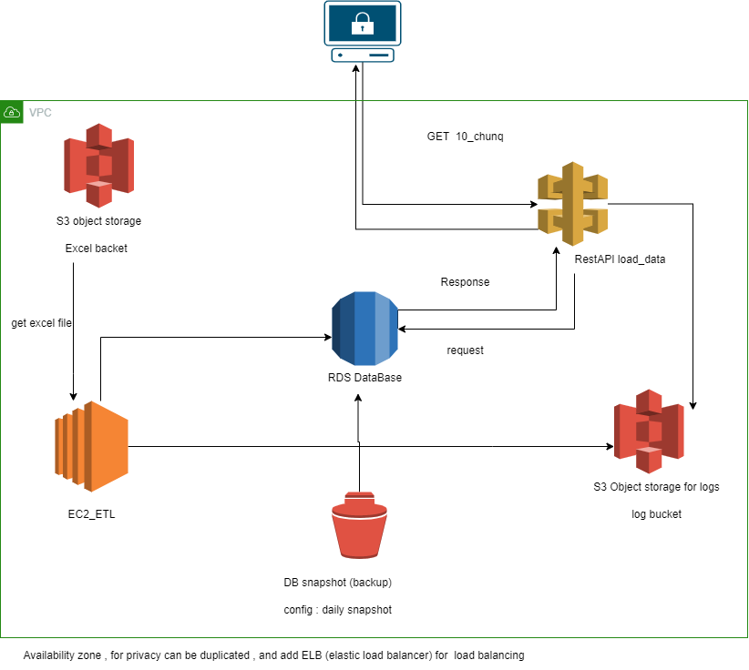

# Extract - Transform - Load
## Dataset:
excel file contains data about GDP in Tunisia
## Project : 
Three main steps are about this project, extracting the data from excel file , making some transformation and then loading the data into a database.

# installation 
- Use python 3.x

run the following command after cloning the repository:
#### create virtual environment
```bash
> python -m venv env
> cd env/scripts
> activate
> cd ../..
```
#### install requirements
```bash
> pip install -r requirements.txt
```

# run the etl package: 

```bash
> python main.py
```
# run tests:
```bash
> python -m unittest     tests.tests.TestReadFromDb
```
# run the api:
```bash
> python api.py
```
and then follow this link : http://127.0.0.1:5000/read/first-chunk

# Conclusion :
    -   all system logs are stored under this directory : logs/record.log

# System Diagram


> - VPC (Availability zone) : Privacy purposes
> - S3 object storage : to store excel files and log files
> - DB snapshot : to save our data (backup)

